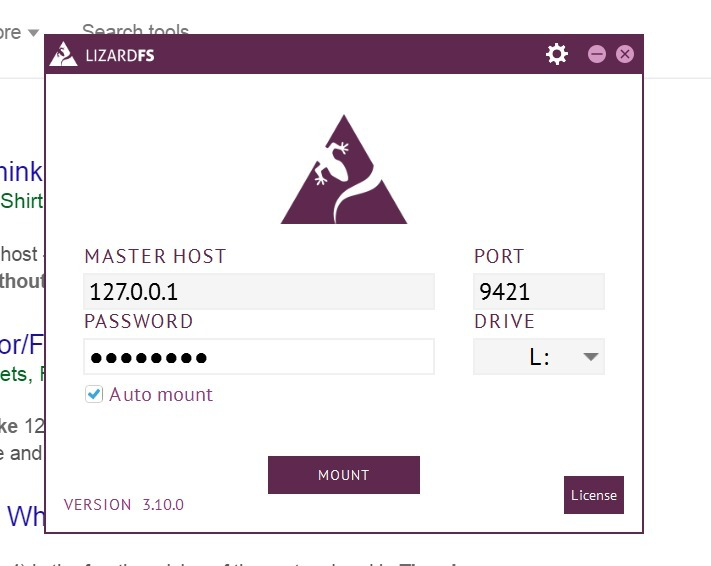

.. _connectclient:

************************************************
Connecting Clients to your LizardFS installation
************************************************
.. auth-status-proof1/none

The most exciting part of this tutorial - you will finally be able to store
files on your installation!

Linux client
============

Install the client package

   Check :ref:`get_and_install` for instructions how to install package

Example for Debian/Ubuntu::

   $ apt-get install lizardfs-client

Set mfsmaster host in /etc/hosts file. For our example configuration it would
be::

   192.168.16.100 mfsmaster

Create a mountpoint::

   $ mkdir /mnt/lizardfs
   $ mfsmount /mnt/lizardfs

That's it.

You can now store your files on your brand new installation.
See man *mfsmount* or *mfsmount -h* for more advanced mount options.

Windows™ client
===============

Install our client from exe package provided

Add your credentials and the address and port of the master server.

Select the drive you want your lizardFS filesystem to appear as in your
windows session.

It should look like in the following image:

Figure 2: main view of LizardFS Windows™ client

Figure 3: My Computer view after mounting LizardFS client

