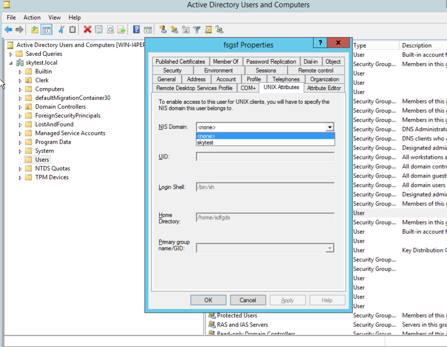

.. _connectclient:

************************************************
Connecting Clients to your LizardFS installation
************************************************
.. auth-status-proof1/none

The most exciting part of this tutorial - you will finally be able to store
files on your installation!

.. _ixclient:

Linux / \*NIX / \*BSD / MacOS/X client
======================================

Install the client package

   Check :ref:`get_and_install` for instructions how to install package

Example for Debian/Ubuntu::

   $ apt-get install lizardfs-client

Make sure that the mfsmaster host is set in your /etc/hosts file. For our
example configuration it would be::

   192.168.16.100 mfsmaster

Create a mountpoint::

   $ mkdir /mnt/lizardfs

Mount the file system to the mount point with just the default options from
mfsmount.cfg if any::

   $ mfsmount /mnt/lizardfs

That's it. Simple, straight and easy.

Optional settings for performance on \*NIX
------------------------------------------

**big_writes**

On most systems adding big_writes to the options will significantly increase
your throughput since it will force the fuse library to use writes > 4k.

Example::

  $ mfsmount -o big_writes,nosuid,nodev,noatime /mnt/lizardfs

will mount with fuse option: big_writes and default system mount options:
nosuid, nodev and noatime.

**Read ahead cache**

If you want to make use of the read ahead caching feature which will
significantly improve your read performance, you will need to configure
the following options::

  -o cacheexpirationtime=MSEC      set timeout for read cache entries to be considered valid in milliseconds (0 disables cache) (default: 0)
  -o readaheadmaxwindowsize=KB     set max value of read ahead window per single descriptor in kibibytes (default:

Example::

  mfsmount -o cacheexpirationtime=500 -o readaheadmaxwindowsize=4096 mountpoint/

Reasonable values:

* cacheexpirationtime - depends on latency, 500 should be alright for most
  installations. Higher values = data will be kept in cache longer, but it
  will also occupy more RAM.
* readaheadmaxwindowsize - depends on latency and cacheexpirationtime,
  1024-8192 are usually fine. Higher values = bigger portions of data asked in
  single request.
* IMPORTANT! Version 3.12 had cacheexpirationtime set by default to 300 (300ms).
  The subsequent versions have this value reverted to 0, because caching is not
  appropriate for some use cases. Please use cacheexpirationtime=0 for turning off cache in 3.12.

readaheadmaxwindowsize can be adjusted to your local requirements - starting
from 1024 and increasing it in small steps until your tests show no more
performance gain is a good idea.

You can now store your files on your brand new installation.

See the :ref:`mfsmount.1` and :ref:`mfsmount.cfg.5` man page for more options

See :ref:`fuse` to find out more about the fuse library.

.. _winclient:

Windows™
========

.. _winsettings:

System Settings for LizardFS clients
------------------------------------

Recommended tuning for Windows™ Clients:

* Make sure your Power Options are set to "High Performance".
* Increase the number of Transfer and Receive Buffers in the configuration
  of your network interface
* Increase the number of Queues available in your network interface setting
* If at all possible set all network devices in your network to use Jumbo
  Frames.

The precise number for your respective host / NIC will be different in every
setup, but they for sure will be far higher than the default settings.

.. _winguiclient:

Windows™ GUI client
-------------------

Install our client from exe package provided

Add your credentials and the address and port of the master server.

Select the drive you want your lizardFS file system to appear as in your
windows session.

It should look like in the following image:

.. image:: ../images/lizardwinclient.png
   :align: center
   :alt: Figure 2: main view of LizardFS Windows™ client

Figure 2: main view of LizardFS Windows™ client

.. _wincliclient:

Windows™ CLI Client
-------------------

Together with the GUI client the installation package adds a CLI client to
your Windows™ system. It is located in::

  C:\Program Files\LizardFS\lizardfscli.exe

Options are:

-H
  The address of the Master
-P
  The port to use at the Master
-D
  The drive letter to use for the mounted FS

.. _winservclient:

Windows™ service
----------------

The Windows™ Client can also be run as a Windows™ Service. This is provided by
the **LizardFSController** command.

Basic configuration
^^^^^^^^^^^^^^^^^^^

Minimal configuration::

  LizardFSController -p -lic-file <LICENSE_FILE> -H <ADDRESS_OF_MASTER>

where LICENSE_FILE should be the name of the file containing a valid License
and ADDRESS_OF_MASTER should be the hostname or IP address of the LizardFS
master server.

Further configuration options
^^^^^^^^^^^^^^^^^^^^^^^^^^^^^

(Must follow the -p command)

======================= =======================================================
Command                 Description
======================= =======================================================
-H HOST                 set master server host address.
-P PORT                 set master server port. Default 9421.
-D DRIVE                set <DRIVE> as a mount point i.e. \D:\. Default L:
-f SUBFOLDER            mount only given LizardFS sub folder
-uid UID                set new UID. Default is 1000.
-gid GID                set new GID. Default is 1000.
-umask UMASK            set new UMASK. Default is 000.
-pass PASS              authenticate to LizardFS master using MD5 password.
-lic LICENSE            set new LICENSE.
-lic-file LICENSE_FILE  load new LICENSE from LICENSE_FILE.
======================= =======================================================

Installation and runtime
^^^^^^^^^^^^^^^^^^^^^^^^

After you have done the configuration, you can add the service to your Windows
system by running::

  LizardFSController -i

and start it by running::

  LizardFSController -s

If you would like to un install the service again, just run::

  LizardFSController -u

To terminate the service, run::

  LizardFSController -t

A full list of options can be displayed using::

  LizardFSController -help

New Windows Client with ACL and AD support
------------------------------------------

To utilize the ACL and AD support in the new Windows CLient you need to do the
following:

* Modify your Active Directory domain controller settings

 * run the following commands in the cmd shell of your Active Directory domain
   controller::

     Dism.exe /online /enable-feature /featurename:adminui /all  &REM admintools
     Dism.exe /online /enable-feature /featurename:nis /all      &REM NIS server
     Dism.exe /online /enable-feature /featurename:psync /all    &REM syncpasswd tools
     shutdown /r /f -t 1                                         &REM reboot

 * for users that need access to the LizardFS drive set fsgsf, tab
   "UNIX Attributes", property "NIS Domain". In the attached picture "skytest"
   is the name of our test domain and it should be selected. Other fields will
   set themselves.

* install the new LizardFS Windows client with ACL support on the end user
  machines.

